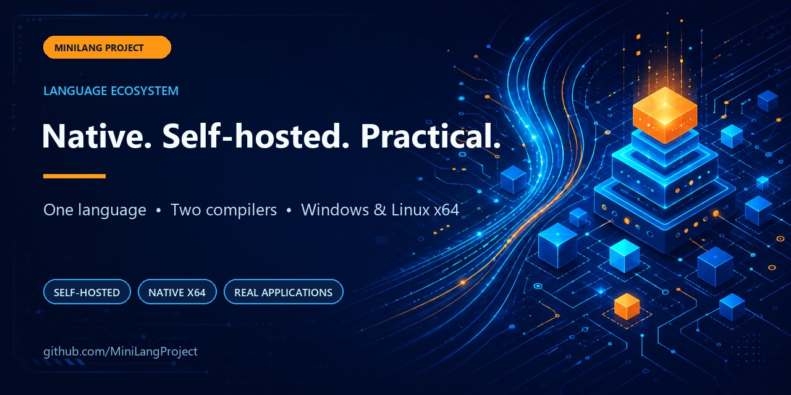

<p align="center">
  
</p>

<p align="center">
  <strong>A self-hosted, dynamically typed programming language that compiles directly to native Windows x64 and Linux x64 executables.</strong>
</p>

<p align="center">
  <a href="https://github.com/MiniLangProject/MiniLangCompilerML">Self-hosted compiler</a> ·
  <a href="https://github.com/MiniLangProject/MiniLangCompilerPy">Reference compiler</a> ·
  <a href="https://github.com/MiniLangProject/MiniLangCompilerML/releases/latest">Latest release</a> ·
  <a href="https://github.com/MiniLangProject/MiniLangCompilerML/blob/main/README.md">Language guide</a>
</p>

## Small language. Native binaries. Real software.

MiniLang emits native **PE32+** and **ELF64** images from its own x86-64
backends. The production compiler is written in MiniLang and reaches a
byte-identical self-hosting fixed point. A separately maintained Python
reference compiler produces compatible executables and provides a transparent
bootstrap path.

```ml
function fibonacci(n)
  if n < 2 then return n end if
  return fibonacci(n - 1) + fibonacci(n - 2)
end function

print fibonacci(10)
```

The language and standard library include structured error handling, garbage
collection, threads and synchronization, networking and TLS, FFI, conditional
compilation, documentation comments, formatting, and a native unit-test
framework.

## Start here

| Project | What it demonstrates |
| --- | --- |
| [**MiniLangCompilerML**](https://github.com/MiniLangProject/MiniLangCompilerML) | The self-hosted MiniLang compiler for Windows and Linux x64 |
| [**MiniLangCompilerPy**](https://github.com/MiniLangProject/MiniLangCompilerPy) | The Python reference and bootstrap compiler |
| [**MiniDoom**](https://github.com/MiniLangProject/MiniDoom) | A full DOOM engine port with classic and OpenGL renderers |
| [**MiniQuake**](https://github.com/MiniLangProject/MiniQuake) | A playable Quake source port preserving Protocol 15 |
| [**MiniSQL**](https://github.com/MiniLangProject/MiniSQL) | A transactional SQL server with concurrency, TLS, and replication |
| [**MiniDoc**](https://github.com/MiniLangProject/MiniDoc) | A self-hosted documentation generator and source analyzer |

More projects explore Quake II, 2D games, native GUIs, installers, and a
lightweight MiniLang IDE. Browse the complete
[repository collection](https://github.com/orgs/MiniLangProject/repositories).

## Reproducibility matters

The two compiler implementations are continuously checked against shared
language behavior and native output. Self-hosted stage builds, Windows/Linux
targets, object-pipeline builds, and representative applications are measured
for correctness, binary compatibility, build time, and memory use. The detailed
evidence and current measurements live in the compiler repositories instead of
being reduced to unsupported headline claims.

## Built in the open

MiniLang and its project family were developed with extensive assistance from
generative AI. The repositories keep the implementation, tests, generated API
documentation, performance reports, and limitations visible so the results can
be inspected and reproduced.

Questions, bug reports, and focused contributions are welcome in the relevant
project repository.

